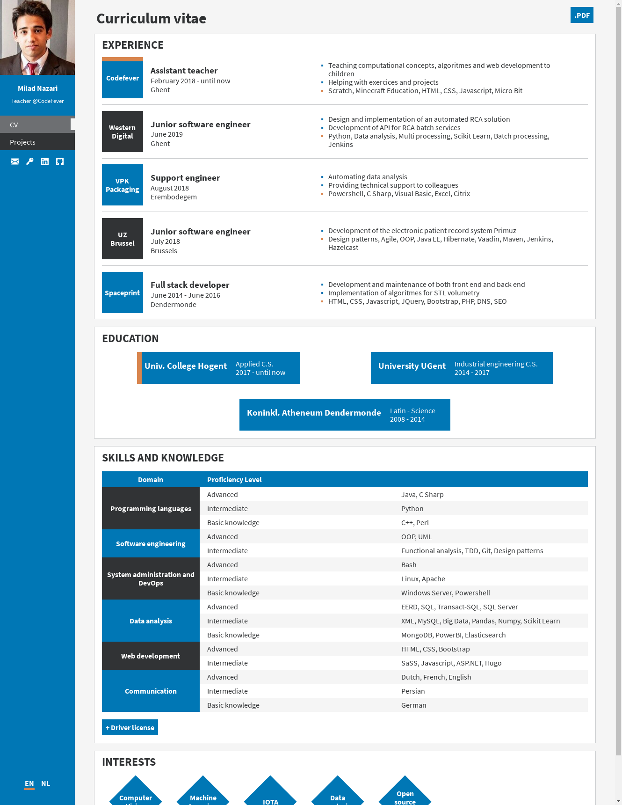
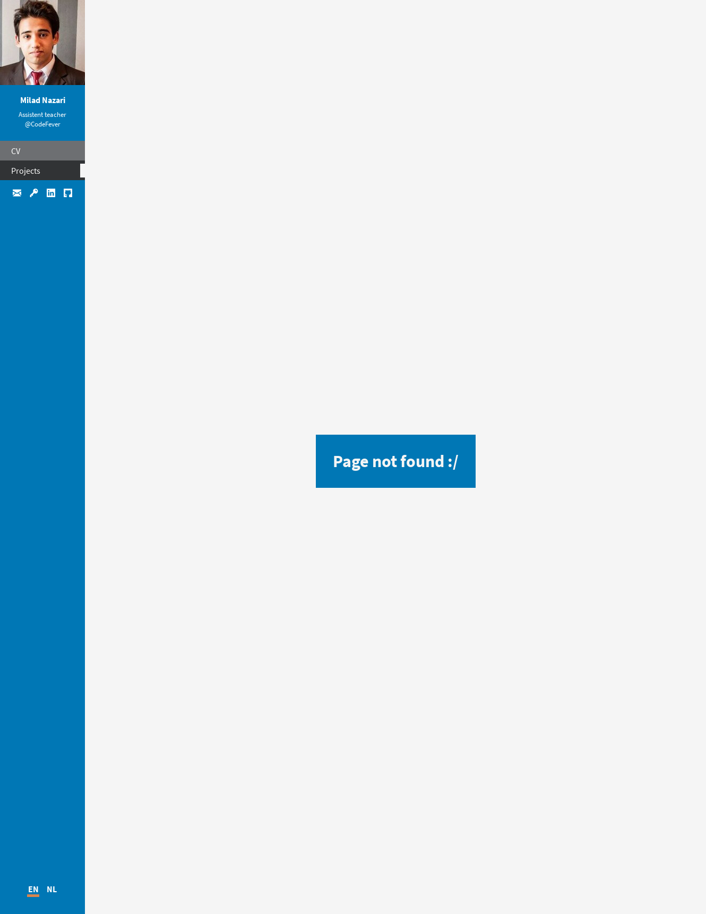
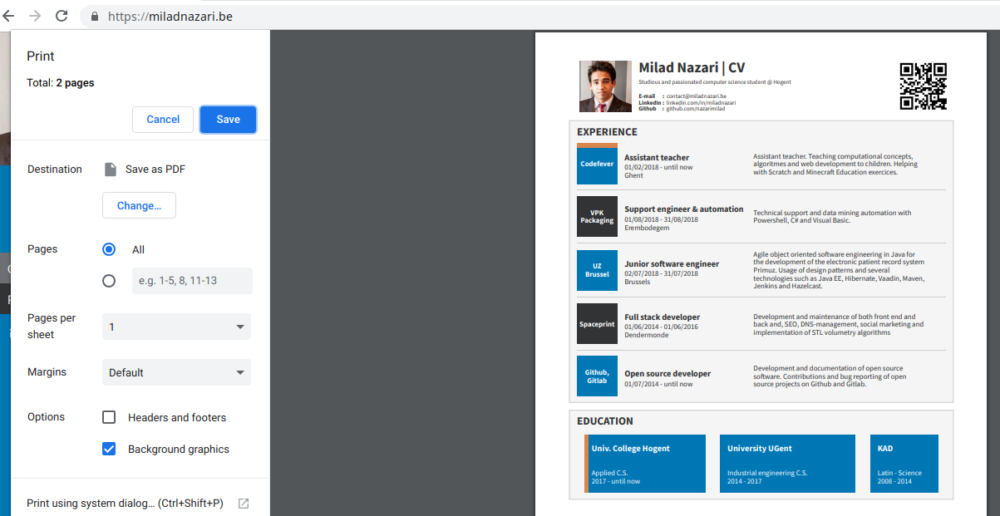

# miladnazari.be

## Description

This repository contains the source code of my personal website [miladnazari.be](https://miladnazari.be/).

The webpages are rendered and minified with the static site generator Hugo. If you're not familiar with Hugo, I suggest reading [this article](https://gohugo.io/getting-started/directory-structure/) to get familiar with the directory structure of Hugo, which is also used here.

## Features

* Clear separation of model from the view/presentation:
    * The only file to change, if you want to use your own resume, is the resume.json file
* Use your already created [resume.json](https://jsonresume.org/) with only a few tweaks
* Lightweight: less than 60 kB currently
* Fast DOM rendering: no frameworks used, and limited amount of requests
* No Javascript: only HTML, SaSS and Go templating syntax
* Responsive design
* Multilingual support
* Flexible design: 
    * When an element or a part of your resume, your education for example, is not available in your resume.json, then it simply won't be rendered in the HTML file, it will not throw any error. It's not required to fill everything in your resume.json
* Nice format when printed: 

## Roadmap

* The QR code image is currently hardcoded for my own       website [miladnazari.be](https://miladnazari.be/). If     you want to use a QR code that links to your domain       name, you have to generate it yourself. 

  The deployement script should generate a QR code using the website URL available in the resume.json, and compress it. 

* We should replace html rendered resume PDF's with latex   PDF's: Currenlty, the PDF's (which can be downloaded by   clicking on the ".PDF"-button) are created with Google    Chrome's "Print as PDF"-function.

  It's a simple solution but the downside is that the forms (the squares, the rectangles, etc), the paddings and the margins together take to much space. Consequently the created PDF has 2 pages altough the needed information could fit in only one page.

* The content tagged with the "print-only"-class are        currently rendered in the HTML and later removed/hidden   with CSS. If we could insert this content only when       someone has the intention to print the website, so when   print.min.css is loaded, it would reducte the size of     the index.html file. 

* Add Blog HTML tempates. It's already possible to create   blog posts but they are not pretty and don't have the     same design as the homepage.

## Strucuture of generated website
(see public/en/ or public/nl/)

* index.html: homepage, resume
* projects/index.html: collection of projects I worked on
* 404.html: HTML page for incorrect URL's or resources                not found

## Prerequisites

* Hugo 0.47 or higher
