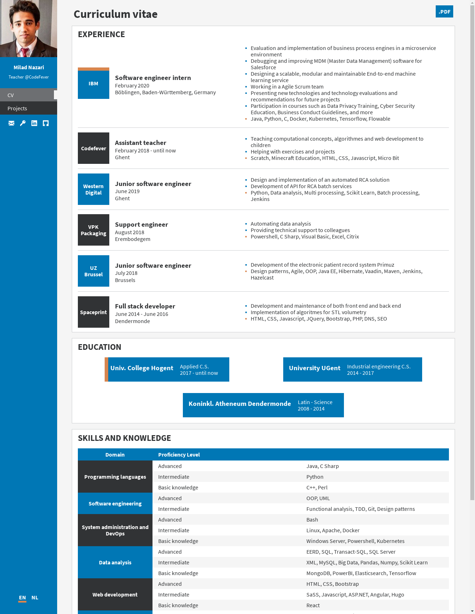
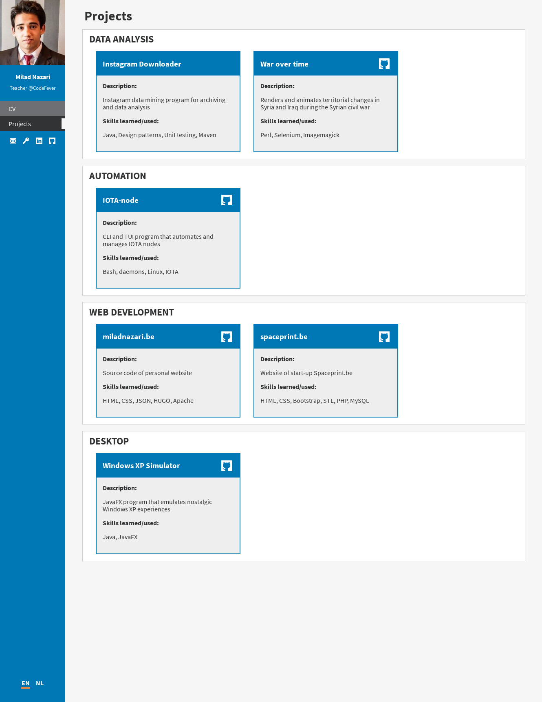
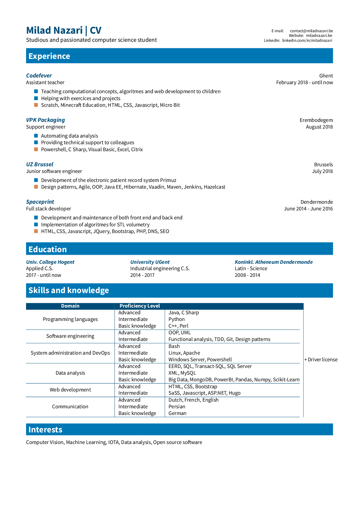

# miladnazari.be

## Description

This repository contains the source code of my personal resume/website [miladnazari.be](https://miladnazari.be/).

The webpages are rendered and minified with the static site generator Hugo. If you're not familiar with Hugo, I suggest reading [this article](https://gohugo.io/getting-started/directory-structure/) to get familiar with the directory structure of Hugo, which is also used here.

## Features

* Two different view outputs: HTML/CSS website and LaTeX PDF 
* Clear separation of model from the view/presentation:
    * The only file to change, if you want to use your own resume, is the resume.json file
* Use your already created [resume.json](https://jsonresume.org/) with only a few tweaks
* Lightweight: homepage is less than 70 kB big currently
* Fast DOM rendering: no frameworks used, and limited amount of resources requested
* No Javascript: only HTML, SaSS, LaTeX and Go templating syntax
* Responsive design
* Multilingual support
* Flexible design: 
    * When an element or a part of your resume, your education for example, is not available in your resume.json, then it simply won't be rendered in the HTML file, it will not throw any error. It's not required to fill everything in your resume.json
* Nicely formatted when printed: 

## Roadmap

* The QR code image is currently hardcoded for my own       website [miladnazari.be](https://miladnazari.be/). If you want to use a QR code that links to your domain name, you have to generate it yourself. 

  Use a script to generate a QR code using the website URL available in the resume.json, and compress it. 

* ~~Replace html rendered resume PDF's with latex PDF's: Currenlty, the PDF's (which can be downloaded by clicking on the ".PDF"-button) are created with Google Chrome's "Print as PDF"-function.~~

  ~~It's a simple solution but the downside is that the forms (the squares, the rectangles, etc), the paddings and the margins together take to much space. Consequently the created PDF has 2 pages altough the needed information could fit in only one page.~~

* The content tagged with the "print-only"-class are        currently rendered in the HTML and later removed/hidden with CSS. Insert this content only when someone has the intention to print the website, so when print.min.css is loaded, it would reducte the size of the index.html file. 

* Create a Python script to let the user:
    * interactively create his/her resume.json or import it
    * choose which parts of the resume.json should be rendered to HTML (website version) and/or PDF (printed LaTeX version)
    * update the website and/or PDF when the resume.json has been altered

* Add Blog HTML tempates. It's already possible to create blog posts but they are not pretty and don't have the same design as the homepage.

* Add extra capabilities to the Python script:
    * Convert LinkedIn profile (from an URL for example) to resume.json
    * Financial and administrative data analysis of companies you want to apply for

* Let the user download blog articles. When clicking on the download button in a blog article/post, a LaTeX-PDF-version of the post is sent.

## Strucuture of generated website
(see public/en/ or public/nl/)

* index.html: homepage, resume
* projects/index.html: collection of projects I worked on
* 404.html: HTML page for incorrect URL's or resources                not found

## Prerequisites

* Hugo 0.47 or higher
